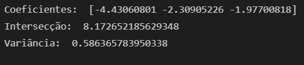
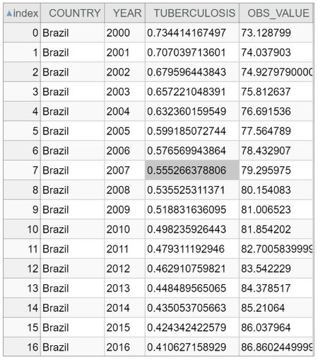
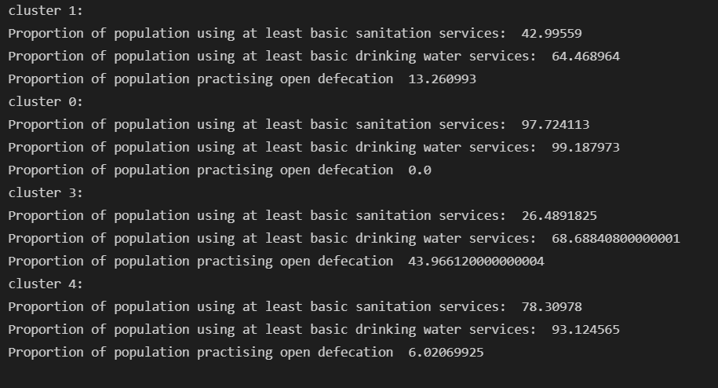

# Projeto `Compreendendo as consequências sanitárias dos índices sociais`

# Equipe `Engenheiros do Açaí` - `EDA`
* `Guilherme Tezoli Bakaukas` - `217332`
* `Lucca Gazotto Vettori` - `240231`
* `Marcelo Salles Previti` - `240765`

## Resumo do Projeto
> O projeto "Compreendendo as consequências sanitárias dos índices sociais", como seu nome indica, visa, a partir de uma grande gama de dados coletados, encontrar as possíveis relações existentes entre diversos índices socioeconômicos dos países com números de mortalidade. Dessa forma, o objetivo final do projeto é poder, baseando-se nos dados disponíveis, responder questionamentos e prever tendências futuras sobre os países.

## Slides da Apresentação
> 

## Modelo Conceitual Preliminar

> 

## Modelos Lógicos Preliminares

> Modelo lógico relacional
~~~
Country(_Country_, Region, Climate)

HDI(country, year, HDI_VALUE)

CHE: country -> Country (Country)

Mortality(country,year,country_code, Cardiovascular diseases (%), Cancers (%), Respiratory diseases (%), Diabetes (%), Dementia (%), Lower respiratory infections (%), Neonatal deaths (%), Diarrheal diseases (%), Road accidents (%), Liver disease (%), Tuberculosis (%), Kidney disease (%), Digestive diseases (%), HIV/AIDS (%), Suicide (%), Malaria (%), Homicide (%), Nutritional deficiencies (%), Meningitis (%), Protein-energy malnutrition (%), Drowning (%), Maternal deaths (%), Parkinson disease (%), Alcohol disorders (%), Intestinal infectious diseases (%), Drug disorders (%), Hepatitis (%), Fire (%), Heat-related (hot and cold exposure) (%), Natural disasters (%), Conflict (%), Terrorism (%))

CHE: country -> Country (Country)

Sanitation(REF_AREA, country, INDICATOR, Indicator, Service Type, year Unit of measure, OBS_VALUE)

CHE: country -> Country (Country)

~~~

> Para o modelo de grafos de propriedades:
>  
> 

## Dataset Publicado
> Elencar os arquivos/bases preliminares dos datasets serão publicados.

título do arquivo/base | link | breve descrição
----- | ----- | -----
`Compreendendo as consequências sanitárias dos índices sociais` | https://www.github.com/lugavt/Projeto_MC536/tree/main/final/data/processed | `O conjunto dos dados conta com um conjunto de quatro datasets que apresentam índices de saneamento, de mortalidade e de IDH dos países numa escala temporal.`

## Bases de Dados

título da base | link | breve descrição
----- | ----- | -----
`Countries of the World` | https://www.kaggle.com/fernandol/countries-of-the-world| `Informações gerais sobre os países (clima, população, etc).`

título da base | link | breve descrição
----- | ----- | -----
`Global Causes of Mortality` | https://www.kaggle.com/michaelpawlus/global-causes-of-mortality| `Informações sobre a distribuição de causas de morte mundialmente no peíodo de 1990 à 2016.`

título da base | link | breve descrição
----- | ----- | -----
`Human Development Index` | https://www.kaggle.com/tjysdsg/human-development-index| `Informações sobre o IDH no peíodo de 1990 à 2016 em escala mundial.`

título da base | link | breve descrição
----- | ----- | -----
`WASH HOUSEHOLDS - WASH HOUSEHOLDS` | https://sdmx.data.unicef.org/webservice/data.html| `Informações sobre saneamento básico, higiene e água potável mundialmente no período de 2000 à 2020.`

## Detalhamento do Projeto

> Para construção do projeto e de suas análises, o grupo passou por alguns passos. Após a decisão do macrotema que seria abordado, a próxima etapa foi começar a procurar quais seriam as fontes de dados que seriam utilizadas. A partir disso, chegou-se a três datasets temporais para diversos países com informações sobre o IDH, dados sobre mortalidade e indicadores de saneamento básico. Dos três bancos encontrados, dois foram a partir do Kaggle e um foi a partir de requisição por API no banco da UNICEF. Nesse momento, chegou-se a um impasse de como centralizar esses dados. Para prosseguir, o grupo encontrou mais um dataset apenas com poucas informações sobre os países apenas para usá-lo como "centro" do dataset que estava sendo criado. Em seguida, o grupo notou a alguns outros problemas nos dados encontrados.
> Para o tratamento dos dados, primeiro houve um cruzamento para analisar quais países estavam frequentes em todos datasets. Depois foi feito um corte temporal nos três datasets iniciais para garantir que todos os dados tivessem as mesmas datas. Foram ignorados os dados faltantes para as análises. Além disso, houve também a transformação de dados a medida que o dataset de IDH possuia um formato diferente dos demais com relação ao dados de ano. Para resolver o conflito, tranformou-se essa base de dados alterando suas colunas para garantir que era compatível com os demais dados. Assim, criou-se uma coluna 'year' na tabela:
~~~python
newIDH_data = pd.melt(IDH_data.reset_index(), id_vars=['HDIRank', 'country'], var_name='year', value_name='HDI_VALUE')
IDH_data = newIDH_data[newIDH_data.year.str.contains("index") == False]
~~~
> Em seguida, para criação do dataset disponibilizado, foi utilizado, como dito anteriormente, o dataset de países para centralizar os dados e, a partir, disso foram criadas as chaves estrangeiras para os outros banco de dados. Para assegurar que a coluna de países seria uma chave estrangeira nas tabelas periféricas, é preciso excluir países que não existam na tabela central de países, como indicado no trecho a seguir:

~~~python
for country in IDH_data["country"]:
    
    if (country not in country_data["Country"].to_numpy()):
        filtered_data = IDH_data["country"] != country
        IDH_data = IDH_data[filtered_data]
~~~

> É possível analisar com mais detalhes o processo de tratamento dos dados no notebook [dataManagement](./notebooks/dataManagement.ipynb).

## Evolução do Projeto
 > Para começar o relatório de evolução, deve-se começar pelo início do projeto, quando o macrotema saúde foi escolhido. Na época ainda não se sabia muito claramente qual caminho seguir a partir da ideia inicial. Em seguida, a partir da nossa primeira apresentação (etapa 2), a ideia passou a ficar mais clara e o grupo optou por focar nas correlações e análises considerando aspectos sanitários, sociais e de mortalidade.
 > Com relação aos modelos desenvolvidos no início do semestre, inicialmente pensamos em concentrar todos os dados em uma tabela apenas, pois as relações são de 1:n. No entanto, percebemos que haveriam algumas linhas com colunas vazias e valores repetidos para algumas colunas. Logo, coletamos um dataset com informações de países e o utilizamos para relacionar com as demais tabelas.
 > Além disso, para desenvolver um modelo de grafos, pensamos em um modelo que facilite a visualização de proximidade entre países com indicadores semelhantes.
 > Como dito anteriormente, o projeto começou de maneira não tão clara. Contudo, o que foi de grande ajuda para prosseguir foi focar em achar o que realmente seria feito com os dados. Isso deve-se ser dito, pois com os dados coletados pelo grupo, diversos tipos diferentes de análise poderiam ter sido feitas. Então encontrar qual seria o foco em cima dos dados coletados foi crucial para o direcionamente do projeto.

## Perguntas de Pesquisa/Análise Combinadas e Respectivas Análises

### Perguntas/Análise com Resposta Implementada

#### Pergunta/Análise 1
> * Qual país adquiriu maior melhora relativa no seu IDH, ao analisar o período de 1990 a 2016? Qual o impacto no perfil de mortalidade desse país?
   

>Para responder essa pergunta, devemos inicialmente selecionar os dados de 1990 e de 2016. Feito isso, nós calculamos a proporção da alteração no IDH e selecionamos o país cujo valor seja máximo. Em SQL, a análise foi feita da seguinte maneira:

~~~SQL
CREATE VIEW IDH2016 AS
    SELECT country, year, HDI_VALUE FROM IDH
        WHERE year = 2016

CREATE VIEW IDH1990 AS
    SELECT country, year, HDI_VALUE FROM IDH
        WHERE year = 1990

CREATE VIEW variacaoIDH AS
    SELECT IDH2016.country, IDH2016.HDI_VALUE/IDH1990.HDI_VALUE as variacao FROM IDH2016, IDH1990
            WHERE IDH2016.country = IDH1990.country

SELECT country, variacao FROM variacaoIDH
    WHERE variacao = (SELECT MAX(variacao) FROM variacaoIDH)
~~~

>Como resultado dessa sequência de queries, obtivemos o país de Moçambique com uma variação de 2,08. A fim de ilustrar essa evolução do IDH, plotamos um gráfico:

>Agora, para entender o impacto dessa elevada alteração de IDH na mortalidade, iremos plotar um gráfico de barras contendo informações de alguns indicadores.

>   * A seguinte query em SQL também gera a mesma informação, porém com todos os índices de mortalidade e em formato tabular:

~~~SQL
SELECT * FROM Mortality
    WHERE country = 'Mozambique' AND (year = 1990 OR year = 2016)
~~~

>Com esses resultados, foi possível notar que embora Moçambique tenha tido um aumento muito significativo em seu IDH, isso não se refletiu em uma queda de índices de mortalidade. Ou seja, pelo gráfico de barras, evidenciamos valores de mortalidade mais elevados em 2016 para diversos indicadores. Portanto, para esse caso analisado, não podemos verificar uma relação inversamente proporcional entre IDH e mortalidade, como imaginávamos.

#### Pergunta/Análise 2
> * Os países que apresentam os melhores valores de IDH também apresentam bons resultados de mortalidade por suicídio?

>Deve-se primeiro deixar claro que "bons resultados" quer dizer valores perto de zero. Dito isso, a ideia da análise é confrontar ou corroborar com a ideia de que países com maiores IDH's não possuem numeros tão expressivos quanto os demais países quando se trata de problemas sociais tão importantes.
Para realizar essa análise, deve-se fazer algumas queries. Primeiro, o grupo viu a necessidade de ordenar a lista de países a partir do valor de IDH em um determinado ano (no caso, 2016).

~~~SQL
CREATE VIEW TOPIDH AS
    SELECT country, HDI_value FROM IDH
    WHERE year = 2016
    ORDER BY HDI_value desc
~~~

>Em seguida, foi realizada outra querie para pegar os 20 países com os maiores valores de IDH. Com esses países listados, foi realizada outra querie para agrupá-los com seus valores de taxa de suicídio. 
 
~~~SQL
CREATE VIEW TOP20IDH AS 
    SELECT top 20 * FROM TOPIDH

CREATE VIEW TOPIDHSUICIDE AS
    SELECT TOP20IDH.country, TOP20IDH.HDI_VALUE, M.Suicide FROM TOP20IDH, Mortality M
        WHERE TOP20IDH.country = M.country AND M.year = 2016
~~~
 
>Por fim, a última querie trata de devolver a média global da taxa de suicídio para poder fazer uma comparação.

~~~SQL
SELECT AVG(Suicide) FROM Mortality
    WHERE year = 2016
~~~

>Com os dados, diferentemente do que pode-se pensar, a grande maioria dos 20 países com os melhores IDH's no ano de 2016 sofreu com taxas de suicídio maiores que a média global que foi de 1.3891157886018581.

#### Pergunta/Análise 3
> * Quais regiões apresentaram aumento nas taxas de suicídio dentre o período de 1990 a 2016?
>   
>Para responder essa análise vamos inicialmente agrupar os países por região definindo seus valores de média. Após isso, basta filtrar as regiões cujos valores de suicídio sejam maiores em 2016 que em 1990. Desse modo temos:

~~~SQL
CREATE VIEW DADOSSUICIDIO AS
    SELECT C.Region, M.year, AVG(M.Suicide) SuicidioMedio FROM Mortality M, Countries C
            WHERE M.country = C.country
            GROUP BY (C.Region, M.year)
            ORDER BY C.Region

SELECT D1.Region FROM DADOSSUICIDIO D1
    WHERE D1.year = 2016 AND D1.SUICIDIOMEDIO > (SELECT D2.SUICIDIOMEDIO FROM DADOSSUICIDIO D2 WHERE D2.year = 1990 AND D1.Region = D2.Region)
~~~

>Como resultado, obtivemos as seguintes regiões:
- C.W. OF IND. STATES
- LATIN AMER. & CARIB
- NEAR EAST
- NORTHERN AFRICA
- SUB-SAHARAN AFRICA

#### Pergunta/Análise 4
> * Previsão de dados de IDH de Brasil
>   
>Para realizar essa análise, optamos por uma análise linear. Pois ao visualizar os dados de IDH do Brasil, percebemos que se aproxima de uma reta.

>Logo, optamos pelo modelo dos mínimos quadrados para gerar a melhor reta y = Ax + B a partir dos dados já obtidos.

>Para construir esse modelo, utilizamos o método de Gauss para resolver um sistema linear gerado pelo algoritmo, a partir dos dados de x e y. Desse modo, temos o seguinte resultado:

>   * Coeficiente linear (B):  -10.30504517705208

>   * Coeficiente angular (A):  0.005489621489624936

>A partir desse modelo, com os coeficientes definidos, é possível prever valores de IDH para um determinado ano. Nesse âmbito, podemos realizar as seguintes previsões e compará-las com os valores reais de IDH desses anos:

>Essa tabela indica que o modelo gerado mostrou-se relativamente fiel com o comportamento do IDH com o tempo. Ou seja, suas previsões apresentaram erros relativos menores que 2.5%, indicando uma precisão razoável.

#### Pergunta/Análise 5
>   * É possível determinar uma relação linear entre IDH e dados de saneamento básico/higiene com os índices de mortalidade por tuberculose? Se sim, qual desses indicadores apresenta maior peso?

>Para responder essa pergunta, utilizaremos uma regressão linear múltipla tal que:

>   * X = [x1, x2, x3] = [IDH, proporção de população com ao menos o básico de saneamento, proporção da população com ao menos o básico de água tratada]
>   * Y = Mortalidade por tuberculose

>Desse modo, através do modelo, é possível determinar os melhores coeficientes para a seguinte equação: Y = A + Bx1 + Cx2 + Dx3.

>Portanto, utilizamos os dados de diversos países que contenham dados desses indicadores X e Y e executamnos o método. Com isso, obtivemos os seguintes valores para os coeficientes:

>A partir dos resultados é possível notar que o dado com maior peso (em valor absoluto) é o coeficiente que acompanha o parâmetro de IDH. Isto é, esse indicador possui maior relevância no momento de prever a mortalidade por tuberculose. 

>No entanto, é possível notar que obtivemos uma variância (score) mediana, indicando pouca precisão. Ou seja, os parâmetros utilizados não descrevem uma relação linear clara com os dados de tuberculose, uma vez que o método prevê uma linearidade e gerou um score não tão elevado.

#### Pergunta/Análise 6

>   * No recorte Brasil, é possível observar uma variação na mortalidade por tuberculose considerando a variação na proporção de pessoas com acesso a saneamento básico?

> A importância dessa questão é confirmar que uma forma de combater uma doença tão relevante como a tuberculose é a partir de investimento em saneamento e saúde públicos. Para encontrar um resultado, deve-se primeiro selecionar os dados de saneamento e de mortalidade por tuberculose no Brasil ao longo dos anos.

~~~SQL
SELECT Mortality.country, Mortality.year, Mortality.Tuberculosis, S.OBS_VALUE FROM Mortality, Sanitation S
    WHERE Mortality.COUNTRY = 'Brazil' AND Mortality.year = S.year AND S.country = 'Brazil' AND S.INDICATOR = 'WS_PPL_S-ALB'
~~~

> Com essa querie, chega-se a uma tabela:

> Vale frisar que "OBS_VALUE" é a porcentagem da população com acesso a saneamento básico.

> Em adição, para auxiliar no entendimento da relação, plotou-se um gráfico:

>Dessa forma, analisando graficamente os dados apresentados, é possível perceber que a medida que há um aumento da porcentagem de pessoas com acesso a saneamento básico, há uma diminuição das mortes relativas a tuberculose. Comprovando, assim, a teoria inicial.

#### Pergunta/Análise 7
 
>   * A partir dos dados de saneamento básico, é possível agrupar os países em clusters baseado nas semelhanças de suas estatísticas, em determinado ano? 

> Esse tipo de análise serve para ilustrar países que se encontram em situações similares no desenvolvimento ao acesso de sanemento básico. A partir disso, pode-se comparar futuramente a evolução de cada país, e comparar de maneira mais eficiente o impacto de eventuais ações governamentais.

> Portanto, para identificar as variações nos índices de saneamento básico de cada cluster, vamos mostrar suas respectivas medianas referentes a cada indicador. 
> Desse modo, obtivemos os seguintes resultados para cada cluster válida:

> Pelos valores acima, foi possível evidenciar diferenças relevantes nos índices de cada cluster. Indicando sucesso no agrupamento por similaridade entre os países.

### Perguntas/Análise Propostas mas Não Implementadas

#### Pergunta/Análise 1
> * Pergunta 1
>   
>   * Explicação em linhas gerais de como a base pode ser usada para responder esta pergunta e a sua relevância.

#### Pergunta/Análise 2
> * Pergunta 2
>   
>   * Explicação em linhas gerais de como a base pode ser usada para responder esta pergunta e a sua relevância.

#### Pergunta/Análise 3
> * Pergunta 3
>   
>   * Explicação em linhas gerais de como a base pode ser usada para responder esta pergunta e a sua relevância.

> Coloque um link para o arquivo do notebook que executa o conjunto de queries. Ele estará dentro da pasta `notebook`. Se por alguma razão o código não for executável no Jupyter, coloque na pasta `src`. Se as queries forem executadas atraves de uma interface de um SGBD não executável no Jupyter, como o Cypher, apresente na forma de markdown.
