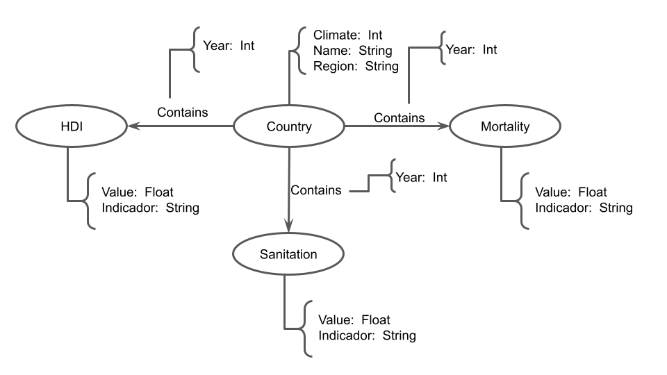
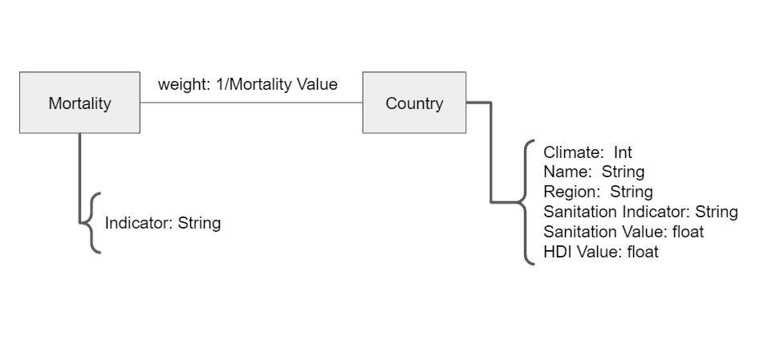

# Modelo para Apresentação do Lab08 - Modelo Lógico e Análise de Dados em Grafos

Estrutura de pastas:

~~~
├── README.md  <- arquivo apresentando a tarefa
│
└── images     <- arquivos de imagem usados na tarefa
~~~

# Equipe `Engenheiros do Açaí` - `EDA`
* `Marcelo Salles Previti` - `240765`
* `Guilherme Tezoli Bakaukas` - `217332`
* `Lucca Gazotto Vettori` - `240231`

## Modelo Lógico Combinado do Banco de Dados de Grafos
> 
> 
>
Modelo referente ao laboratório anterior
> 
Modelo mais interessante para fazer as análises de grafos. No caso, o peso das arestas será o inverso da porcentagem referente aquela mortalidade no país. Isso significa que países com altas taxas daquela determinada estatística ficarão espacialmente mais próximos. Além disso, vale ressaltar que tal modelo de grafo será repetido uma vez a cada ano.

## Perguntas de Pesquisa/Análise Combinadas e Respectivas Análises

>
### Pergunta/Análise 1
> * Quais países apresentam problemas de saúde semelhantes?
>   
>   * Através de uma análise de comunidade, espera identificar clusters de países que enfrentam realidades semelhantes (e.g. países subdesenvolvidos devem ter altas mortalidades relacionadas a problemas sanitários). 

### Pergunta/Análise 2
> * Qual a evolução de um país ao longo do tempo em relação aos outros de mesma cluster?
>   
>   * Esta pergunta vem da adição de uma dimensão temporal da pergunta anterior. No caso, pode-se comparar a evolução de determinado país (seja em questão de IDH ou de alguma outra doença específica) em relação a cluster que pertence.
### Pergunta/Análise 3
> * Inferência de valores faltantes
>   
>   * Eventualmente, em uma atualização do banco de daods, alguns países poderão ficar com valores nulos para certos tipos de doenças. Dessa forma, pode-se supor os valores faltantes através de uma predição de links
