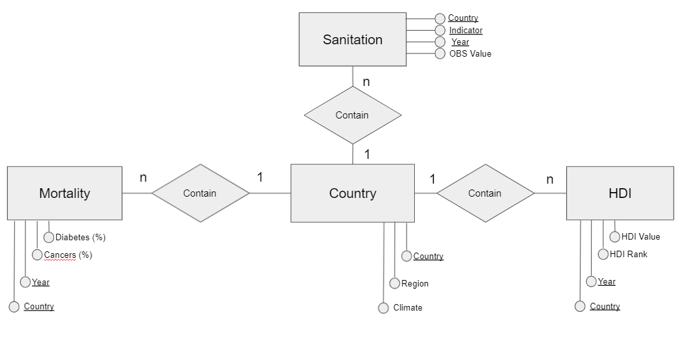
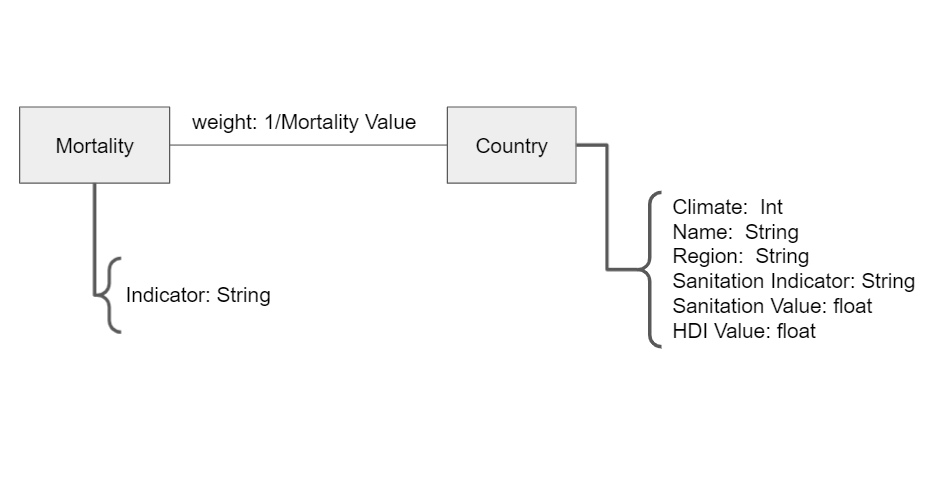

# Projeto `Compreendendo as consequências sanitárias dos índices sociais`

# Equipe `Engenheiros do Açaí` - `EDA`
* `Guilherme Tezoli Bakaukas` - `217332`
* `Lucca Gazotto Vettori` - `240231`
* `Marcelo Salles Previti` - `240765`

## Resumo do Projeto
> O projeto "Compreendendo as consequências sanitárias dos índices sociais", como seu nome indica, visa, a partir de uma grande gama de dados coletados, encontrar as possíveis relações existentes entre diversos índices socioeconômicos dos países com números de mortalidade. Dessa forma, o objetivo final do projeto é poder, baseando-se nos dados disponíveis, responder questionamentos e prever tendências futuras sobre os países.

## Slides da Apresentação
> Coloque aqui o link para o PDF da apresentação prévia

## Modelo Conceitual Preliminar

> 

## Modelos Lógicos Preliminares

> Modelo lógico relacional
~~~
Country(_Country_, Region, Climate)

HDI(country, year, HDI_VALUE)

CHE: country -> Country (Country)

Mortality(country,year,country_code, Cardiovascular diseases (%), Cancers (%), Respiratory diseases (%), Diabetes (%), Dementia (%), Lower respiratory infections (%), Neonatal deaths (%), Diarrheal diseases (%), Road accidents (%), Liver disease (%), Tuberculosis (%), Kidney disease (%), Digestive diseases (%), HIV/AIDS (%), Suicide (%), Malaria (%), Homicide (%), Nutritional deficiencies (%), Meningitis (%), Protein-energy malnutrition (%), Drowning (%), Maternal deaths (%), Parkinson disease (%), Alcohol disorders (%), Intestinal infectious diseases (%), Drug disorders (%), Hepatitis (%), Fire (%), Heat-related (hot and cold exposure) (%), Natural disasters (%), Conflict (%), Terrorism (%))

CHE: country -> Country (Country)

Sanitation(REF_AREA, country, INDICATOR, Indicator, Service Type, year Unit of measure, OBS_VALUE)

CHE: country -> Country (Country)

~~~

> Para o modelo de grafos de propriedades:
>  
> 

## Dataset Preliminar a ser Publicado
> Elencar os arquivos/bases preliminares dos datasets serão publicados publicados.

título do arquivo/base | link | breve descrição
----- | ----- | -----
`<título do arquivo/base>` | `<link para arquivo/base>` | `<breve descrição do arquivo/base>`

> Os arquivos finais do dataset publicado devem ser colocados na pasta `data`, em subpasta `processed`. Outros arquivos serão colocados em subpastas conforme seu papel (externo, interim, raw). A diferença entre externo e raw é que o raw é em formato não adaptado para uso. A pasta `raw` é opcional, pois pode ser substituída pelo link para a base original da seção anterior.
> Coloque arquivos que não estejam disponíveis online e sejam acessados pelo notebook. Relacionais (usualmente CSV), XML, JSON e CSV ou triplas para grafos.

## Bases de Dados
> Elencar as bases de dados fonte utilizadas no projeto.

título da base | link | breve descrição
----- | ----- | -----
`Countries of the World` | https://www.kaggle.com/fernandol/countries-of-the-world| `Informações gerais sobre os países (clima, população, etc).`

título da base | link | breve descrição
----- | ----- | -----
`Global Causes of Mortality` | https://www.kaggle.com/michaelpawlus/global-causes-of-mortality| `Informações sobre a distribuição de causas de morte mundialmente no peíodo de 1990 à 2016.`

título da base | link | breve descrição
----- | ----- | -----
`Human Development Index` | https://www.kaggle.com/tjysdsg/human-development-index| `Informações sobre o IDH no peíodo de 1990 à 2016 em escala mundial.`

título da base | link | breve descrição
----- | ----- | -----
`WASH HOUSEHOLDS - WASH HOUSEHOLDS` | https://sdmx.data.unicef.org/webservice/data.html| `Informações sobre saneamento básico, higiene e água potável mundialmente no período de 2000 à 2020.`

## Operações realizadas para a construção do dataset

> Coloque um link para o arquivo do notebook, programas ou workflows que executam as operações de construção do dataset:
* extração de dados de fontes não estruturadas como, por exemplo, páginas Web
* agregação de dados fragmentados obtidos a partir de API
* integração de dados de múltiplas fontes
* tratamento de dados
* transformação de dados para facilitar análise e pesquisa

> Se for notebook, ele estará dentro da pasta `notebook`. Se por alguma razão o código não for executável no Jupyter, coloque na pasta `src`. Se as operações envolverem queries executadas atraves de uma interface de um SGBD não executável no Jupyter, como o Cypher, apresente na forma de markdown.

## Perguntas de Pesquisa/Análise Combinadas e Respectivas Análises

> Liste aqui as perguntas de pesquisa/análise e respectivas análises.
> Nem todas as perguntas precisam de queries que as implementam.
> É possível haver perguntas em que a solução é apenas descrita para
> demonstrar o potencial da base.
>
### Pergunta/Análise 1
> * No contexto Brasil, existe alguma relação entre a variação do percentual de pessoas com acesso à saneamento básico e dos números de mortalidade por tuberculose? 
>   
>   * Para responder tal questionamento sobre a tuberculose, foram feitas as seguintes análises/queries: primeiramente foi feito um corte na tabela de mortalidade visando encontrar apenas os dados de mortalidade por tuberculose no Brasil ao longo dos anos. Em seguida, esses dados foram cruzados com os dados de acesso à saneamento básico no Brasil no mesmo período. Por fim, com a tabela já estruturada, a análise feita consistiu em observar o comportamento das duas colunas. O resultado observado foi que a medida que o IDH foi aumentando no país, as taxas de mortalidade por tuberculose foram diminuindo.

### Pergunta/Análise 2
> * Pergunta 2
>   
>   * Explicação sucinta da análise que será feita ou conjunto de queries que
>     responde à pergunta.

### Pergunta/Análise 3
> * Pergunta 3
>   
>   * Explicação sucinta da análise que será feita ou conjunto de queries que
>     responde à pergunta.

> Coloque um link para o arquivo do notebook que executa o conjunto de queries. Ele estará dentro da pasta `notebook`. Se por alguma razão o código não for executável no Jupyter, coloque na pasta `src`. Se as queries forem executadas atraves de uma interface de um SGBD não executável no Jupyter, como o Cypher, apresente na forma de markdown.
